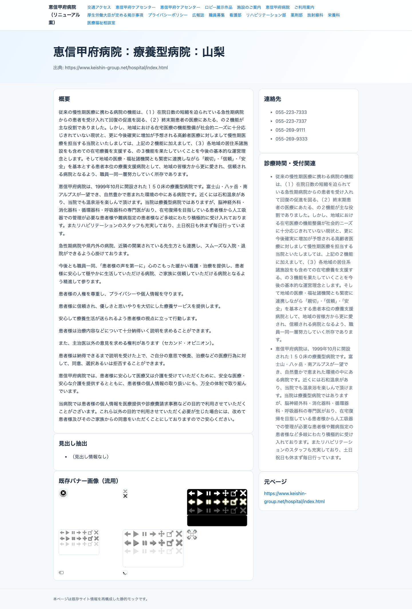
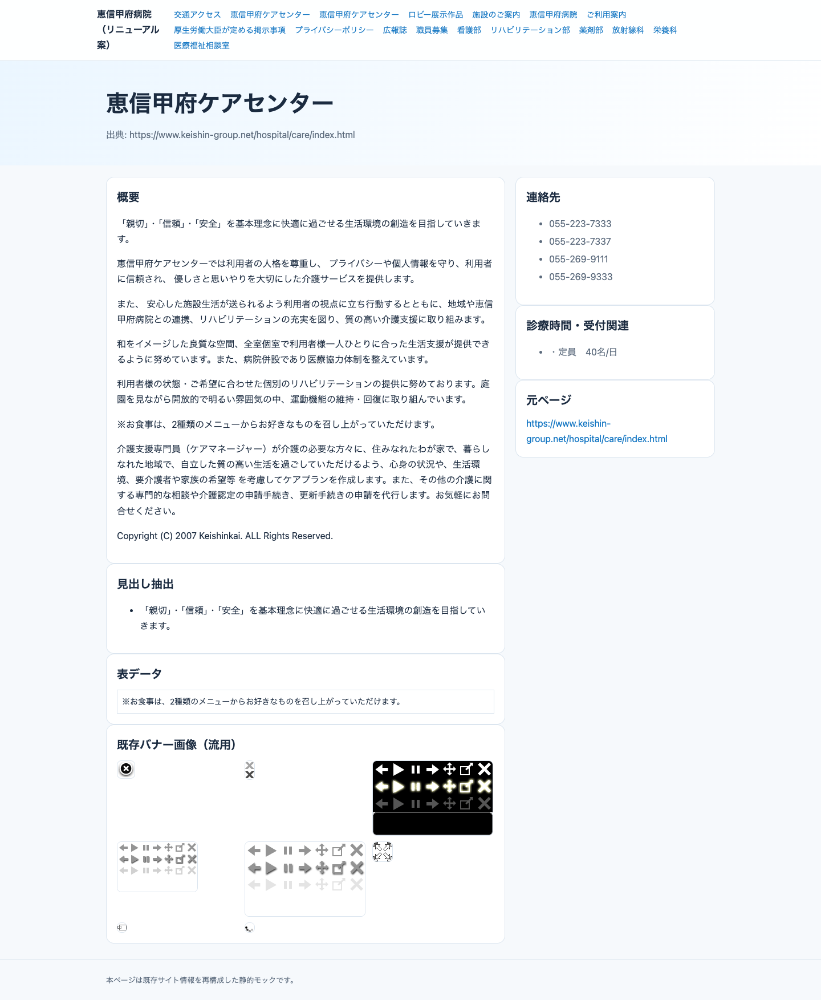
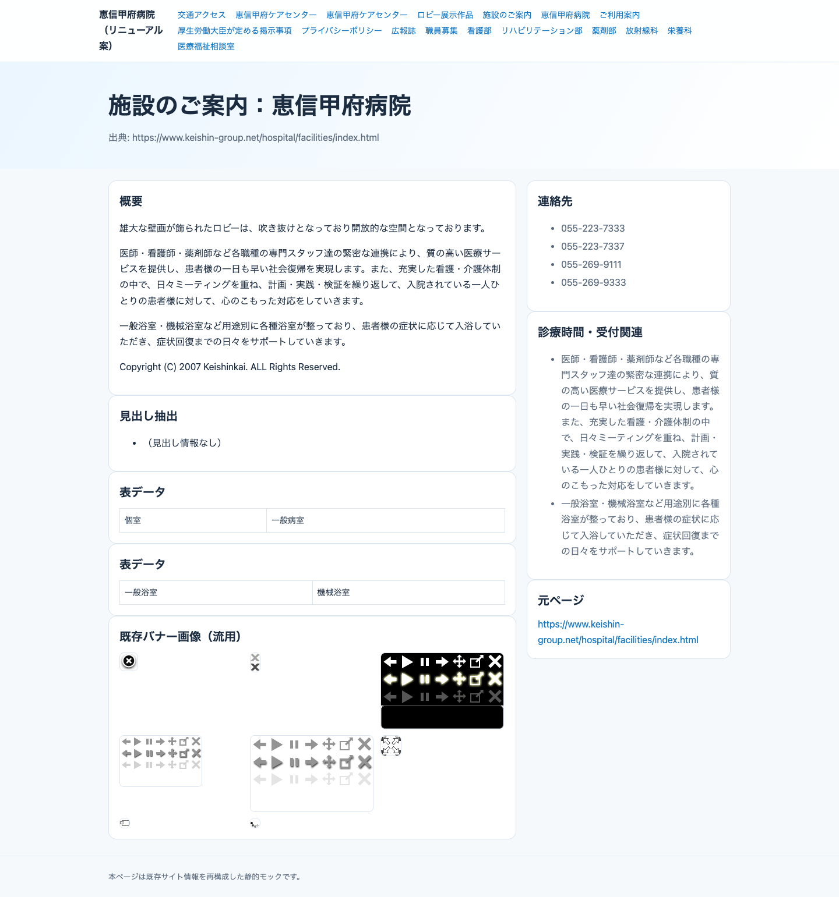

# keishin-hospital-redesign

静的HTMLサイトを GitHub Pages で公開するためのリポジトリです。

## 公開

- `main` への push を契機に GitHub Actions が実行され、GitHub Pages へデプロイされます。
- デプロイ設定は `.github/workflows/deploy-pages.yml` を参照。

## 監査スクリーンショット（代表）

READMEに貼る場合は以下をそのまま使えます。

```md





```

実ファイル:
- `_audit/index_desktop.png`
- `_audit/index_mobile.png`
- `_audit/care_index_desktop.png`
- `_audit/access_index_mobile.png`
- `_audit/facilities_index_desktop.png`
